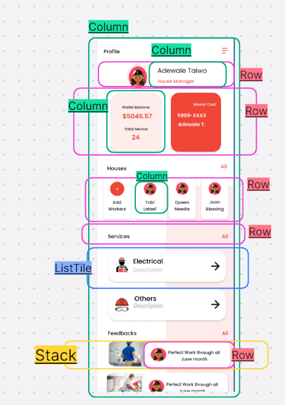
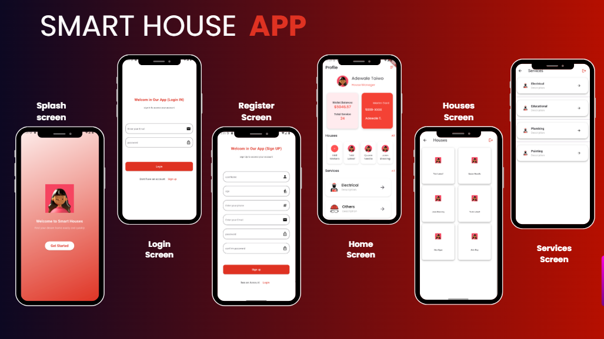

# 📱 ProfileDashboard - Flutter  

ProfileDashboard is a modern Flutter application built with **Material Design** principles.  
It demonstrates clean UI, reusable widgets, and a smooth navigation flow across multiple screens.

---

## 🚀 Features  
- Beautiful **Splash Screen** with branding.  
- **Login & Signup** flows with clean and intuitive design.  
- A centralized **Home Dashboard** with quick navigation.  
- Dedicated **Services Screen** showcasing available services in a grid layout.  
- **Houses Screen** with visual browsing experience.  
- Responsive design and scrollable content.  

---

## 📌 Widgets Used  
- **MaterialApp** → The root of the app with Material Design styling.  
- **Scaffold** → Provides the base layout with AppBar, Body, and more.  
- **AppBar** → Displays the top navigation bar with actions and title.  
- **CircleAvatar** → Perfect for profile images and social icons.  
- **Text** → Displays names, descriptions, and labels.  
- **Row & Column** → Align elements horizontally and vertically.  
- **Container** → Adds styling, background, and spacing.  
- **Icon** → Interactive icons like call, share, and message.  
- **TextButton** → For actions like "Contact Us".  
- **SingleChildScrollView** → Makes content scrollable on smaller devices.  
- **Stack** → Overlays widgets, e.g., profile image over background.  
- **ListTile** → Pre-styled rows with icons, titles, and trailing actions.  
- **BoxDecoration & BoxShadow** → Customizes visuals with rounded corners and shadows.  

---

## 🖼 Screens Preview  

- **Splash Screen** → Welcomes the user with branding and smooth transition.  
- **Login Screen** → Secure, clean, and user-friendly access for existing users.  
- **Signup Screen** → A simple and intuitive way for new users to register.  
- **Home Screen** → The main dashboard with navigation to all features.  
- **Services Screen** → A grid-based layout showcasing available services.  
- **Houses Screen** → A clean, card-style layout displaying houses with images and names.  

---

## 🎨 Design Layout  

---

## 📷 Final Result  
  
